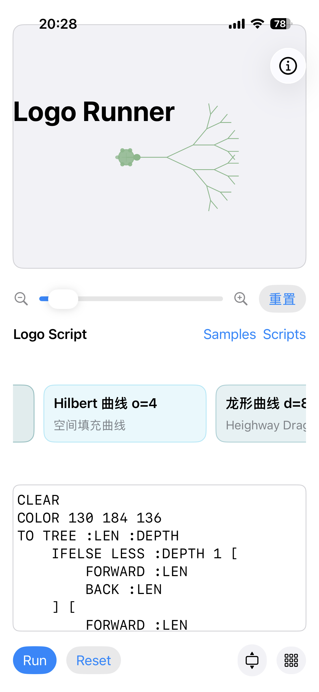
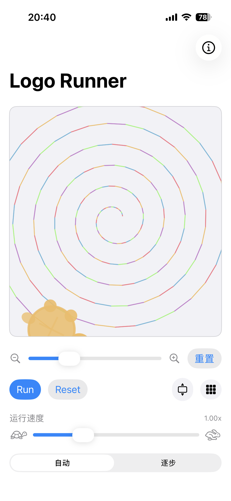
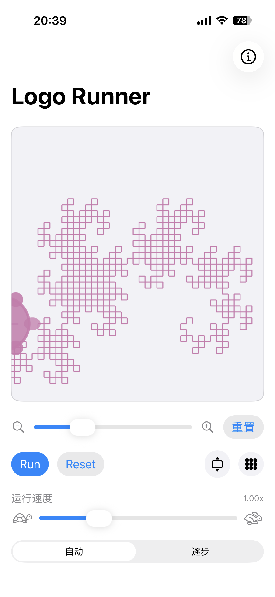

# Logo Runner

Logo Runner 是一个基于 SwiftUI 的 iOS Logo 语言实验场。

Logo Runner is a SwiftUI playground for experimenting with the Logo programming language on iOS.

## Screenshots








## Highlights
- **实时 Logo 解释器** —— 支持多海龟、带参数过程、变量、算术助手、条件语句（支持含可选 else 块的 `IF`、`IFELSE`）以及分形友好的递归深度保护。
- **丰富示例库** —— 精选 100 份脚本，涵盖分形、多海龟协作、色彩爆发、函数式组合等主题，并按类别以横向卡片呈现。
- **脚本工作台** —— 等宽编辑器配合关键字工具栏，自动保存最近脚本，提供保存、重命名、刷新与载入对话框。
- **播放控制** —— 支持 0.25×–3× 的动画速度调节，可切换到逐步播放模式按片段查看绘制过程。
- **交互画布** —— 可捏合缩放、拖拽平移、双击或点击重置居中，海龟标记以俯视视角绘制并随方向旋转。
- **Live Logo Interpreter** – Supports multiple turtles, parameterised procedures, variables, arithmetic helpers, conditionals (`IF`, `IFELSE` with optional else blocks) and fractal-friendly recursion safeguards.
- **Rich Sample Library** – 100 curated examples spanning fractals, multi-turtle choreography, colour bursts, and functional compositions. Samples are organised by category with a horizontal carousel.
- **Script Workspace** – Monospaced editor with keyword toolbar, persistent autosave, and dialogs to save, rename, refresh, and reload your own scripts.
- **Playback Controls** – Choose automatic animation (speed slider from 0.25×–3×) or manual step-by-step playback with segment scrubbing.
- **Interactive Canvas** – Pinch to zoom, drag to pan, double-tap or press reset to recenter. The turtle marker draws in a top-down view aligned with its heading.

## Building
```bash
xcodebuild -scheme Logo -destination 'platform=iOS Simulator,name=iPhone 15' build
```
> If the simulator destination is unavailable, open `Logo.xcodeproj` in Xcode and run on an available device or simulator.

```bash
xcodebuild -scheme Logo -destination 'platform=iOS Simulator,name=iPhone 15' build
```
> 如果指定模拟器不可用，请直接在 Xcode 中打开 `Logo.xcodeproj` 并选择可用的设备或模拟器运行。

## Running Tests
```bash
xcodebuild test -scheme Logo -destination 'platform=iOS Simulator,name=iPhone 15'
```

```bash
xcodebuild test -scheme Logo -destination 'platform=iOS Simulator,name=iPhone 15'
```

## Getting Started
1. Launch the app; a default square script renders immediately.
2. Use **Samples** to explore curated programs or **Scripts** to save/load custom work.
3. Toggle **自动/逐步** playback to switch between automatic animation and manual stepping.
4. Adjust the slider to change playback speed or zoom controls to inspect intricate fractals.
1. 启动应用即可看到默认正方形脚本。
2. 使用 **Samples** 浏览精选程序，或通过 **Scripts** 保存/载入自定义脚本。
3. 切换 **自动 / 逐步** 控件以选择动画或逐段播放模式。
4. 利用速度滑杆与缩放控件调整节奏，便于观察复杂分形细节。

## Directory Layout
- `Logo/` – SwiftUI app sources (`ContentView`, `LogoInterpreter`, supporting utilities).
- `LogoTests/` – Unit specs using Swift Testing (add new tests here).
- `LogoUITests/` – UI automation harnesses.
- `Logo.xcodeproj/` – Xcode project configuration.
- `Logo/` —— SwiftUI 应用源文件（`ContentView`、`LogoInterpreter` 等）。
- `LogoTests/` —— 使用 Swift Testing 的单元测试。
- `LogoUITests/` —— UI 自动化测试套件。
- `Logo.xcodeproj/` —— Xcode 工程配置。

## Logo Dialect Notes
- Commands are case-insensitive (`FD`, `FORWARD`, `COLOR`, `MAKE`, etc.).
- Variables use the traditional `MAKE "NAME value` and `:NAME` dereference conventions.
- `IF condition [true] [false]` accepts an optional else block; `IFELSE` remains for explicit two-branch logic.
- Built-in math helpers: `SUM`, `DIFFERENCE`, `PRODUCT`, `QUOTIENT`, `REMAINDER`, `POWER`, `ABS`, `NEG`, `MIN`, `MAX`, `LESS`, `GREATER`, `EQUAL`, `NOTEQUAL`, `RANDOM`, `PI`, `E`.
- 指令不区分大小写（`FD`、`FORWARD`、`COLOR`、`MAKE` 等）。
- 变量遵循传统的 `MAKE "NAME value` 与 `:NAME` 取值语法。
- `IF 条件 [成立操作] [不成立操作]` 的第二个方括号可选；`IFELSE` 依旧提供明确的双分支。
- 内置数学助手：`SUM`、`DIFFERENCE`、`PRODUCT`、`QUOTIENT`、`REMAINDER`、`POWER`、`ABS`、`NEG`、`MIN`、`MAX`、`LESS`、`GREATER`、`EQUAL`、`NOTEQUAL`、`RANDOM`、`PI`、`E`。

## Contributing
1. Fork & clone the repository.
2. Create a feature branch.
3. Update tests and docs where relevant.
4. Open a pull request following the project’s commit and PR guidelines in `AGENTS.md`.
1. Fork 并克隆仓库。
2. 创建功能分支开展开发。
3. 按需补充或更新测试与文档。
4. 参照 `AGENTS.md` 中的提交与 PR 规范发起合并请求。
